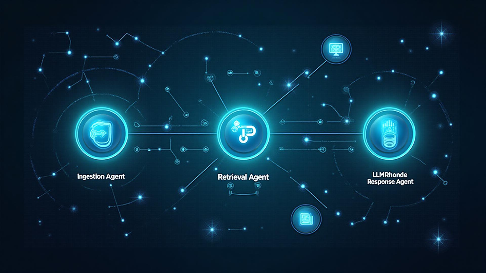

# Agentic RAG Chatbot with Model Context Protocol (MCP)

A sophisticated full-stack Retrieval-Augmented Generation (RAG) chatbot system that uses a multi-agent architecture with Model Context Protocol for intelligent document processing and question answering.



## 🌟 Features

### Document Processing
- **Multi-format Support**: PDF, DOCX, CSV, PPTX, TXT, and Markdown files
- **Intelligent Chunking**: Optimized text segmentation for better retrieval
- **Real-time Processing**: Live updates during document ingestion

### Agentic Architecture
- **IngestionAgent**: Parses, chunks, and preprocesses uploaded documents
- **RetrievalAgent**: Performs vector search and context retrieval using embeddings
- **LLMResponseAgent**: Generates contextual responses using retrieved information

### Model Context Protocol (MCP)
- Structured inter-agent communication
- Message tracing and debugging
- Asynchronous agent coordination
- Real-time status monitoring

### User Interface
- **Modern Chat Interface**: Clean, responsive design with dark theme
- **Real-time Agent Status**: Visual feedback on agent processing
- **Source Attribution**: Direct links to source documents in responses
- **File Management**: Easy document upload and organization

## 🏗️ Architecture

```
┌─────────────────┐    MCP     ┌─────────────────┐    MCP     ┌─────────────────┐
│  IngestionAgent │ ────────→  │ RetrievalAgent  │ ────────→  │LLMResponseAgent │
│                 │            │                 │            │                 │
│ • Parse docs    │            │ • Vector search │            │ • Generate      │
│ • Chunk text    │            │ • Find context  │            │   response      │
│ • Preprocess    │            │ • Rank results  │            │ • Format output │
└─────────────────┘            └─────────────────┘            └─────────────────┘
         │                              │                              │
         ▼                              ▼                              ▼
┌─────────────────┐            ┌─────────────────┐            ┌─────────────────┐
│   Document      │            │   Vector DB     │            │    LLM API      │
│   Storage       │            │   (FAISS)       │            │   (OpenAI)      │
└─────────────────┘            └─────────────────┘            └─────────────────┘
```

## 🚀 Quick Start

### Prerequisites
- Node.js 18+ and npm
- Python 3.9+
- OpenAI API key (or alternative LLM provider)

### Frontend Setup
```bash
# Clone the repository
git clone <repository-url>
cd agentic-rag-chatbot

# Install dependencies
npm install

# Start the development server
npm run dev
```

### Backend Setup
```bash
# Navigate to backend directory
cd backend

# Create virtual environment
python -m venv venv
source venv/bin/activate  # On Windows: venv\Scripts\activate

# Install dependencies
pip install -r requirements.txt

# Set environment variables
export OPENAI_API_KEY="your-api-key-here"

# Start the FastAPI server
uvicorn main:app --reload --port 8000
```

## 📋 Tech Stack

### Frontend
- **React 18** with TypeScript
- **Tailwind CSS** for styling
- **Lucide React** for icons
- **Vite** for build tooling

### Backend
- **FastAPI** for the REST API
- **Python** for agent implementation
- **FAISS** for vector storage and similarity search
- **OpenAI Embeddings** for text vectorization
- **PyPDF2, python-docx** for document parsing

## 🔧 Configuration

### Environment Variables
Create a `.env` file in the backend directory:
```env
OPENAI_API_KEY=your_openai_api_key
HUGGINGFACE_API_KEY=your_huggingface_key  # Optional
VECTOR_DB_PATH=./data/vector_store
UPLOAD_PATH=./uploads
```

### Agent Configuration
Agents can be configured in `backend/config/agents.py`:
```python
AGENT_CONFIG = {
    "ingestion": {
        "chunk_size": 1000,
        "chunk_overlap": 200,
        "supported_formats": [".pdf", ".docx", ".csv", ".pptx", ".txt", ".md"]
    },
    "retrieval": {
        "top_k": 5,
        "similarity_threshold": 0.7,
        "embedding_model": "text-embedding-ada-002"
    },
    "response": {
        "model": "gpt-4",
        "max_tokens": 2000,
        "temperature": 0.7
    }
}
```

## 📡 Model Context Protocol (MCP)

The system implements MCP for structured inter-agent communication:

```python
# Example MCP message
{
    "type": "RETRIEVAL_RESULT",
    "sender": "RetrievalAgent",
    "receiver": "LLMResponseAgent", 
    "trace_id": "rag-457",
    "timestamp": "2025-01-30T10:30:00Z",
    "payload": {
        "retrieved_context": [
            "slide 3: revenue up 15% Q1",
            "doc: Q1 summary shows KPI improvements"
        ],
        "query": "What KPIs were tracked in Q1?",
        "confidence_scores": [0.92, 0.87],
        "source_documents": ["sales_review.pdf", "metrics.csv"]
    }
}
```

## 🧪 Sample Workflow

1. **Upload Documents**: Upload `sales_review.pdf` and `metrics.csv`
2. **Ask Question**: "What KPIs were tracked in Q1?"
3. **Agent Processing**:
   - IngestionAgent parses and chunks documents
   - RetrievalAgent finds relevant context using vector search
   - LLMResponseAgent generates response with sources
4. **Display Results**: Chat interface shows answer with source attribution

## 🎯 API Endpoints

### Document Management
- `POST /api/upload` - Upload documents
- `GET /api/documents` - List uploaded documents
- `DELETE /api/documents/{id}` - Delete document

### Chat Operations
- `POST /api/chat` - Send message and get response
- `GET /api/chat/history` - Get conversation history
- `WebSocket /ws/chat` - Real-time chat updates

### Agent Status
- `GET /api/agents/status` - Get current agent states
- `WebSocket /ws/agents` - Real-time agent updates

## 🔍 Development

### Running Tests
```bash
# Frontend tests
npm test

# Backend tests
cd backend
pytest tests/
```

### Code Structure
```
src/
├── components/
│   ├── ChatInterface.tsx      # Main chat component
│   ├── FileUploader.tsx       # Document upload
│   ├── AgentStatus.tsx        # Agent monitoring
│   └── MessageBubble.tsx      # Chat messages
├── hooks/
├── lib/
└── pages/

backend/
├── agents/
│   ├── ingestion_agent.py     # Document processing
│   ├── retrieval_agent.py     # Vector search
│   └── response_agent.py      # LLM integration
├── mcp/
│   ├── protocol.py            # MCP implementation
│   └── message_types.py       # Message schemas
├── services/
│   ├── document_service.py    # Document management
│   └── vector_service.py      # Vector operations
└── main.py                    # FastAPI application
```

## 📚 Documentation

- [Architecture Guide](./docs/architecture.md)
- [API Documentation](./docs/api.md)
- [MCP Protocol Specification](./docs/mcp-spec.md)
- [Deployment Guide](./docs/deployment.md)

## 🤝 Contributing

1. Fork the repository
2. Create a feature branch (`git checkout -b feature/amazing-feature`)
3. Commit your changes (`git commit -m 'Add amazing feature'`)
4. Push to the branch (`git push origin feature/amazing-feature`)
5. Open a Pull Request

## 📄 License

This project is licensed under the MIT License - see the [LICENSE](LICENSE) file for details.

## 🔮 Future Enhancements

- **Multi-modal Support**: Process images, audio, and video files
- **Advanced Retrieval**: Implement hybrid search and re-ranking
- **Agent Orchestration**: Add more specialized agents (summarization, translation, etc.)
- **Knowledge Graphs**: Integration with graph databases for entity relationships
- **Collaborative Features**: Multi-user conversations and document sharing

## 📞 Support

For questions and support:
- Create an issue in the GitHub repository
- Check the [documentation](./docs/)
- Join our [Discord community](https://discord.gg/agentic-rag)

---

Built with ❤️ using React, FastAPI, and advanced AI techniques.